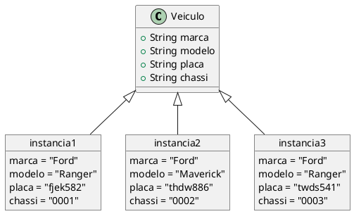
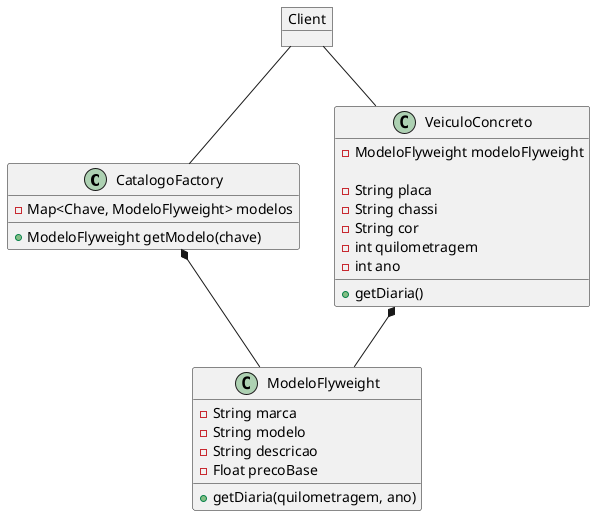

# Flyweight

### Padrão de Projeto Estrutural

## Intenção

O padrão Flyweight tem como objetivo compatilhar dados em comum entre grandes volumes de objetos para gerenciar o armazenamento de instâncias carregadas memória de uma maneira eficiente.

## Motivação

Algumas aplicações podem tirar proveito em instanciar objetos por todo o seu design, porém uma implementação ingênua pode ser proibitivamente cara em termos de memória.

Por exemplo, imagine uma aplicação que lide com a criação e gerenciamento de objetos que representam veículos. Um veículo posssui características que são comuns a uma grande quantidade de veículos semelhantes a ele, como a sua marca e modelo. Há também outras características que são de caráter individual, como a sua placa e chassi. Se cada objeto veículo armazenar a sua marca e modelo, esses valores poderão ser repetidos em cada instância na memória, gerando redundância.

Nesta aplicação, ocasionalmente haverá um cenário em que existam 1000 instâncias de carros da marca "Ford", fazendo com que 1000 strings com valor "Ford" sejam armazenadas na memória. Mas e se houvesse apenas uma única string com o valor "Ford" e todos os veículos desta marca a referenciasse? Está é essencialmente a proposta do Flyweight.

Com isso posto, existem informações sobre o objeto veículo que são intrínsecas à ele, isto é, podem ser compartilhadas por outros objetos, e informações extrínsecas, que são singulares de cada instância do objeto e dependem de um contexto para serem definidas.

## Estrutura

## Participantes

- #### CatalogoFactory
Cria e gerencia objetos flyweight. Assegura que objetos flyweight estão sendo compartilhados corretamente. Quando o cliente pede um flyweight o CatalogoFactory providencia uma instância exisnte ou cria uma caso não exista.

- #### VeiculoConcreto
VeiculoConcreto possui o estado intrísenco do flyweight que não deve ser compartilhado e os seu estado extrínseco que é dado pelo cliente.

- #### ModeloFlyweight
Declara o estado intrínseco do flyweight, isto é, tudo que pode ser compartilhado entre objetos na aplicação.

- #### Client
Mantém uma referência ao flyweight, armazena e cria estados extrínsecos do flyweight.

## Aplicabilidade

Como e quando o padrão Flyweight deve ser aplicado:

- Uma aplicação utiliza um grande número de objetos.
- Os custos de armazenamento são altos devido à grande quantidade de objetos.
- A maior parte do estado dos objetos pode ser tornada extrínseca.
- Muitos grupos de objetos podem ser substituídos por relativamente poucos objetos compartilhados, uma vez que o estado extrínseco é removido.
- A aplicação não depende da identidade dos objetos. - Como os objetos Flyweight podem ser compartilhados, testes de identidade retornarão verdadeiro para objetos que, conceitualmente, deveriam ser distintos.

## Colaborações
- O estado necessário para que um Flyweight funcione deve ser classificado como intrínseco ou extrínseco. O estado intrínseco é mantido dentro do ConcreteFlyweight, enquanto o estado extrínseco fica sob responsabilidade dos objetos Cliente, que podem armazená-lo ou calculá-lo conforme necessário. Esse estado é fornecido ao Flyweight sempre que uma de suas operações for chamada.

- Os Clientes não devem criar instâncias de ConcreteFlyweights diretamente. Em vez disso, devem obtê-las por meio do FlyweightFactory, garantindo o uso compartilhado correto desses objetos.

## Consequências

O uso de Flyweights pode gerar custos adicionais em tempo de execução devido à necessidade de transferir, localizar e/ou calcular o estado extrínseco, especialmente quando esse estado antes fazia parte do estado intrínseco. No entanto, esses custos são compensados pela economia de espaço, que se torna mais significativa à medida que mais Flyweights são compartilhados.

A economia de armazenamento depende de diversos fatores:

- A redução no número total de instâncias graças ao compartilhamento.
- O volume de estado intrínseco armazenado por cada objeto.
- Se o estado extrínseco é armazenado ou calculado dinamicamente.

Quanto maior o compartilhamento de Flyweights, maior a economia de memória. O benefício se torna ainda mais expressivo quando os objetos possuem uma grande quantidade de estado intrínseco e extrínseco, e quando esse último pode ser calculado em vez de armazenado. Dessa forma, a otimização ocorre em duas frentes: o compartilhamento reduz o custo do estado intrínseco, enquanto o estado extrínseco pode ser substituído por processamento, reduzindo ainda mais a necessidade de armazenamento.

## Usos comuns

- #### Renderização de Texto
    Compartilhamento de glifos para representar caracteres em editores de texto e sistemas de tipografia.
- #### Gráficos e Jogos
    - Compartilhamento de sprites ou modelos 3D para otimizar o uso de memória.
    - Instâncias de partículas em efeitos visuais (fumaça, explosões, neve).
- #### Interfaces Gráficas (GUI)
    Compartilhamento de layouts e estilos em widgets como botões e menus.
Suporte para diferentes temas sem duplicar objetos.
- #### Sistemas de Documentos
    Representação de estruturas repetitivas, como tabelas e seções, sem alocar objetos desnecessários.
- #### Sistemas de Geolocalização
    Compartilhamento de informações sobre locais, como nomes de cidades e coordenadas.